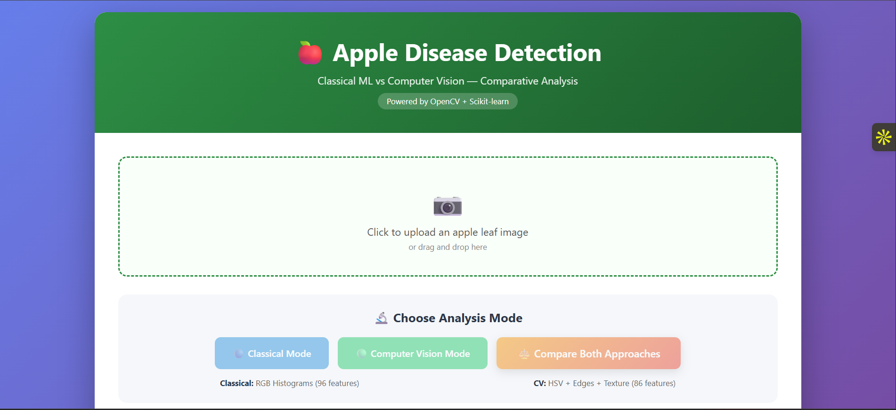
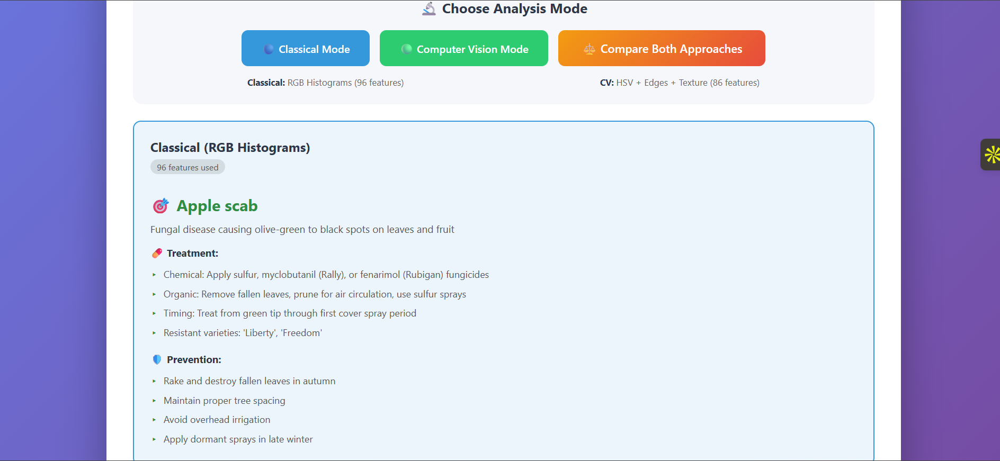
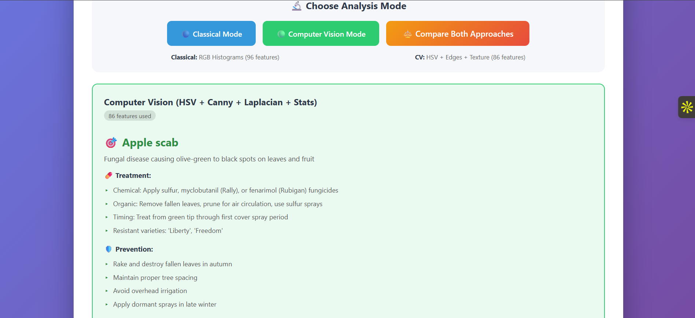
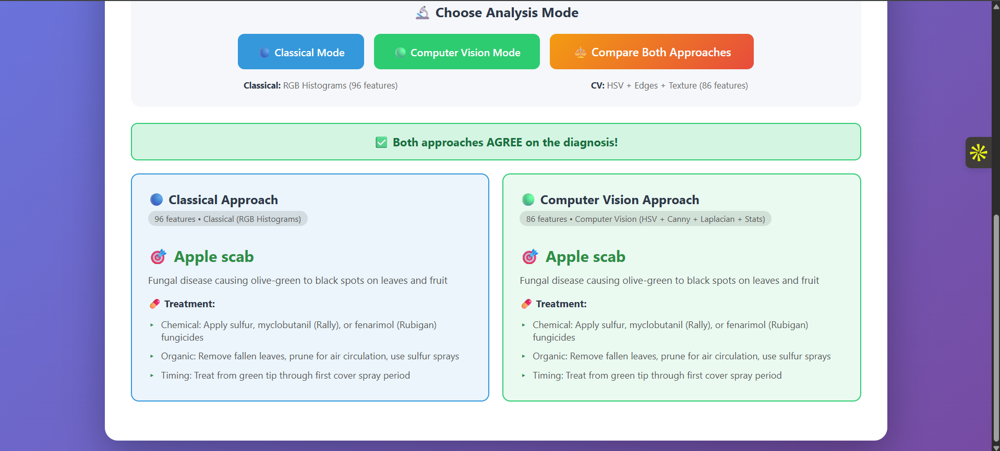

# 🍎 Apple Tree Leaf Disease Detection

> **An AI-powered web application that detects apple leaf diseases using a comparative approach: Classical Machine Learning vs Advanced Computer Vision.**


---

## 🎯 Overview

**AppleTree** is a comprehensive machine learning system that detects diseases in apple tree leaves and recommends treatment strategies. The unique aspect of this project is its **dual-approach architecture** — implementing and comparing two distinct ML pipelines:

1. **Classical ML Approach** — Using RGB color histograms (96 features)
2. **Computer Vision Approach** — Using advanced OpenCV features (86 features)

The web app allows users to test either approach individually or **compare both side-by-side** on the same image.

---

## 🌟 Features

### 🎨 Web Application
- 📤 Drag-and-drop image upload
- 🔬 **Three analysis modes**:
  - Classical Mode (RGB Histograms)
  - Computer Vision Mode (HSV + Edges + Texture)
  - **Compare Both** (side-by-side comparison)
- 🤝 Agreement detection between approaches
- 🚨 Anomaly detection for non-leaf images
- 💊 Detailed treatment recommendations
- 🛡️ Prevention strategies

### 🔬 Disease Detection
Detects 4 apple leaf categories:
- 🟢 **Healthy** leaves
- 🦠 **Apple Scab** (Venturia inaequalis)
- 🔴 **Black Rot** (Botryosphaeria obtusa)
- 🟡 **Cedar Apple Rust** (Gymnosporangium juniperi-virginianae)

### 🧪 Machine Learning Pipeline
- **Models compared**: Random Forest, SVM, KNN
- **Preprocessing**: MinMaxScaler, PCA dimensionality reduction
- **Class balancing**: SMOTE oversampling
- **Anomaly detection**: Isolation Forest

---

## 📊 Performance Metrics

### Model Comparison (Classical Approach)

| Model | Accuracy | Precision | Recall | F1-Score | ROC-AUC |
|-------|:--------:|:---------:|:------:|:--------:|:-------:|
| Random Forest | 76.54% | 81.09% | 76.54% | 75.03% | 96.03% |
| **SVM** ⭐ | **92.60%** | **92.67%** | **92.60%** | **92.54%** | **98.93%** |
| KNN | 84.25% | 85.14% | 84.25% | 84.32% | 95.78% |

> 🏆 **Best Model: SVM** with 92.60% accuracy

### Approach Comparison

| Approach | Features | Method |
|----------|:--------:|--------|
| Classical ML | 96 | RGB Histograms (32 bins × 3 channels) |
| Computer Vision | 86 | HSV Histograms + Canny Edges + Laplacian Texture + Channel Statistics |

---

## 🖼️ Screenshots

### Home Page


### Classical Mode Result


### Computer Vision Mode Result


### Comparison View ⭐


---

## 🛠️ Tech Stack

### Backend
- **Python 3.13** — Core language
- **Flask** — Web framework
- **OpenCV** — Image processing & feature extraction
- **scikit-learn** — Machine learning models
- **imbalanced-learn** — SMOTE oversampling
- **NumPy & Pandas** — Data manipulation
- **joblib** — Model serialization

### Frontend
- **HTML5 / CSS3** — Modern, responsive UI
- **JavaScript** — Async API calls and dynamic rendering
- **Drag & Drop API** — Image upload

### Visualization
- **Matplotlib & Seaborn** — Charts and confusion matrices

---

## 📁 Project Structure

```
appletree/
├── 📄 apple.py                       # Flask web application (main entry)
├── 📄 model_comparision.py           # Trains and compares classical models
├── 📄 train_cv_models.py             # Trains computer vision models
├── 📄 cv_vs_ml_comparison.py         # Compares CV vs Classical approaches
├── 📄 requirements.txt               # Python dependencies
├── 📄 README.md                      # This file
│
├── 📂 templates/
│   └── index.html                    # Web app UI
│
├── 📂 train/                         # Training dataset
│   ├── Apple___Apple_scab/
│   ├── Apple___Black_rot/
│   ├── Apple___Cedar_apple_rust/
│   └── Apple___healthy/
│
├── 📂 output/                        # Generated charts & results
│   ├── confusion_matrix_*.png
│   ├── model_comparison_results.csv
│   ├── cv_vs_ml_results.csv
│   └── *.png
│
├── 🧠 Models (Classical Approach)
│   ├── apple_disease_model.pkl
│   ├── scaler.pkl
│   ├── pca.pkl
│   ├── label_encoder.pkl
│   └── anomaly_detector.pkl
│
└── 🧠 Models (Computer Vision Approach)
    ├── cv_apple_disease_model.pkl
    ├── cv_scaler.pkl
    ├── cv_pca.pkl
    ├── cv_label_encoder.pkl
    └── cv_anomaly_detector.pkl
```

---

## 🚀 Installation & Setup

### Prerequisites
- Python 3.8 or higher
- Git
- pip package manager

### Step 1: Clone the Repository

```bash
git clone https://github.com/dy1325577-ctrl/Apple-Tree-leaf-disease-detection.git
cd Apple-Tree-leaf-disease-detection/appletree
```

### Step 2: Create Virtual Environment

```bash
# Windows
python -m venv venv
venv\Scripts\activate

# Mac/Linux
python -m venv venv
source venv/bin/activate
```

### Step 3: Install Dependencies

```bash
pip install --upgrade pip
pip install -r requirements.txt
```

### Step 4: Download the Dataset

Download the **PlantVillage Apple Dataset** from Kaggle:
- 🔗 [PlantVillage Dataset](https://www.kaggle.com/datasets/abdallahalidev/plantvillage-dataset)

Extract and place only the apple folders in a `train/` directory:

```
train/
├── Apple___Apple_scab/         (~630 images)
├── Apple___Black_rot/          (~621 images)
├── Apple___Cedar_apple_rust/   (~275 images)
└── Apple___healthy/            (~1645 images)
```

### Step 5: Train the Models

```bash
# Train classical models (RGB histograms)
python model_comparision.py

# Train computer vision models (HSV + Edges + Texture)
python train_cv_models.py
```

### Step 6: Run the Web App

```bash
python apple.py
```

Open your browser and navigate to:
```
http://127.0.0.1:5007
```

---

## 🔬 Methodology

### Classical Approach (RGB Histograms)
1. Resize image to **32×32** pixels
2. Extract **RGB color histograms** (32 bins per channel = 96 features)
3. Apply **MinMaxScaler** normalization
4. Reduce dimensions using **PCA**
5. Classify using **SVM** (best performer)

### Computer Vision Approach (Advanced CV)
1. Resize image to **64×64** pixels
2. Extract multiple feature types using OpenCV:
   - **HSV color histograms** — 24 bins × 3 channels = 72 features
   - **Canny edge density** — 1 feature
   - **Channel statistics** (BGR + HSV mean/std) — 12 features
   - **Laplacian variance** for texture — 1 feature
3. Total: **86 meaningful features**
4. Apply **MinMaxScaler** normalization
5. Reduce dimensions using **PCA** (95% variance retained)
6. Classify using **SVM** with RBF kernel

### Anomaly Detection
**Isolation Forest** is used to detect images that are not apple leaves. If detected, the system informs the user and suggests verifying the image.

---

## 📈 Dataset Statistics

| Class | Training Images | Percentage |
|-------|:---------------:|:----------:|
| Apple Scab | 630 | 19.9% |
| Black Rot | 621 | 19.6% |
| Cedar Apple Rust | 275 | 8.7% |
| Healthy | 1,645 | 51.9% |
| **Total** | **3,171** | **100%** |

> ⚠️ **Class imbalance handled with SMOTE** (Synthetic Minority Oversampling Technique)

---

## 🎯 API Endpoints

The Flask app exposes the following endpoints:

| Endpoint | Method | Description |
|----------|:------:|-------------|
| `/` | GET | Renders the home page UI |
| `/predict` | POST | Predicts disease (mode: `classical` or `cv`) |
| `/compare` | POST | Compares both approaches on same image |
| `/status` | GET | Returns model availability status |

### Example: cURL Usage

```bash
# Classical mode prediction
curl -X POST -F "file=@leaf.jpg" -F "mode=classical" http://127.0.0.1:5007/predict

# Computer Vision mode prediction
curl -X POST -F "file=@leaf.jpg" -F "mode=cv" http://127.0.0.1:5007/predict

# Compare both approaches
curl -X POST -F "file=@leaf.jpg" http://127.0.0.1:5007/compare
```

---

## 🔮 Future Enhancements

- [ ] Deep Learning approach (CNN comparison)
- [ ] Real-time leaf detection via webcam
- [ ] Multi-language support
- [ ] Mobile app (React Native / Flutter)
- [ ] Severity grading (mild/moderate/severe)
- [ ] More plant species support
- [ ] Cloud deployment (AWS / Heroku)
- [ ] Database for historical predictions

---

## 🧪 Testing

Test the system with sample images:

```bash
# Make sure the server is running
python apple.py

# In another terminal, test with cURL
curl -X POST -F "file=@test_images/scab.jpg" http://127.0.0.1:5007/compare
```

---

## 📚 References & Dataset

- **PlantVillage Dataset** — [Kaggle Link](https://www.kaggle.com/datasets/abdallahalidev/plantvillage-dataset)
- **OpenCV Documentation** — [opencv.org](https://docs.opencv.org/)
- **scikit-learn Documentation** — [scikit-learn.org](https://scikit-learn.org/)
- **Flask Documentation** — [flask.palletsprojects.com](https://flask.palletsprojects.com/)

---

## 🤝 Contributing

Contributions, issues, and feature requests are welcome!

1. Fork the repository
2. Create your feature branch (`git checkout -b feature/AmazingFeature`)
3. Commit your changes (`git commit -m 'Add some AmazingFeature'`)
4. Push to the branch (`git push origin feature/AmazingFeature`)
5. Open a Pull Request

---

## 📄 License

This project is licensed under the MIT License — see the [LICENSE](LICENSE) file for details.

---

## 👨‍💻 Author

**Dhruv**

- GitHub: [@dy1325577-ctrl](https://github.com/dy1325577-ctrl)
- Email: your.email@example.com

---

## 📊 Project Stats


---

<p align="center">
  <strong>⭐ If you found this project helpful, please give it a star! ⭐</strong>
</p>

<p align="center">
  Made with ❤️ for sustainable agriculture and plant health
</p>